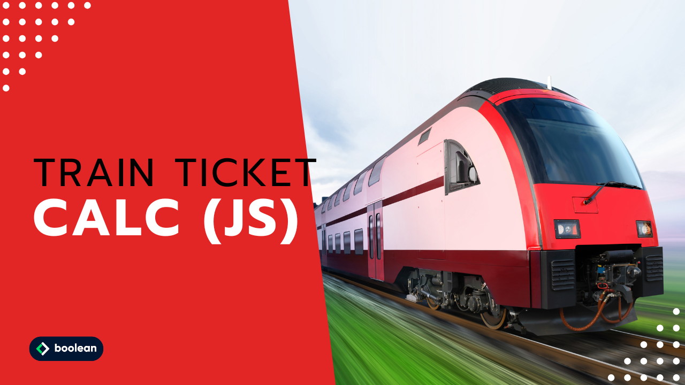

 
Diciottesimo Esercizio Classe #137 - Boolean

---

Studente: Fabio Ferrero

---
# English

## Target of the project:
The program will have to ask the user for the number of miles he or she wants to travel and the age of the passenger.
Based on this information it will have to calculate the total price of the trip, according to these rules:
- the ticket price is defined on the basis of kilometers (0.21 € per km)
- a 20% discount is to be applied for minors
- a 40% discount is to be applied for those over 65.
- The output of the final price is to be put out in human form (with maximum two decimals, to indicate cents on the price). This will require a minimum of research.

---
# Italiano

## Obiettivo del progetto:
Il programma dovrà chiedere all’utente il numero di chilometri che vuole percorrere e l’età del passeggero.
Sulla base di queste informazioni dovrà calcolare il prezzo totale del viaggio, secondo queste regole:
- il prezzo del biglietto è definito in base ai km (0.21 € al km)
- va applicato uno sconto del 20% per i minorenni
- va applicato uno sconto del 40% per gli over 65.
- L’output del prezzo finale va messo fuori in forma umana (con massimo due decimali, per indicare centesimi sul prezzo). Questo richiederà un minimo di ricerca.
---

